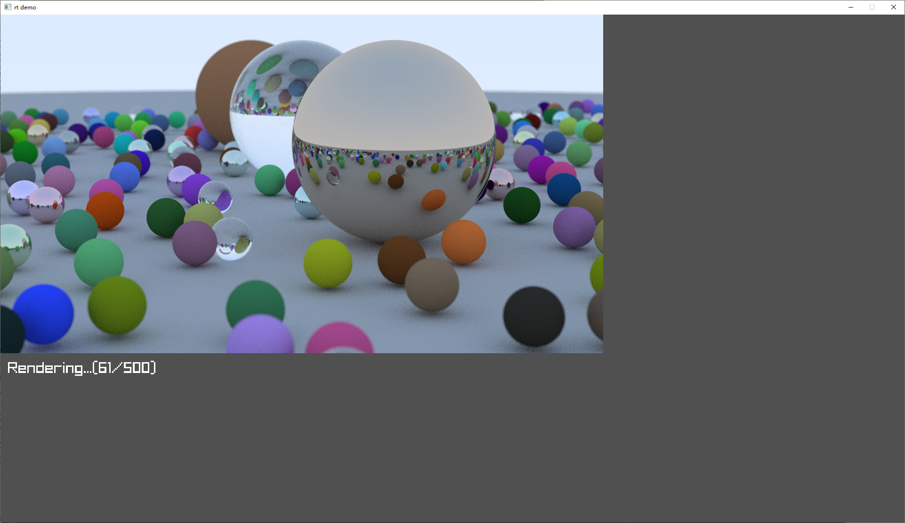
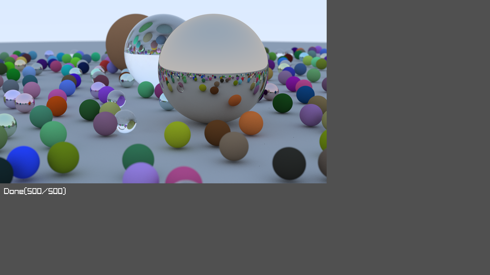

This is an improved version of [the ray tracing program I previously wrote](https://github.com/t0byn/ray_tracing_in_one_weekend). The one I wrote before is running on CPU and using single thread, which is very slow. 
This time I used raylib and compute shader to put the computation on the GPU side, which renders the image faster since GPU has many threads. Also it now renders the image in real time.

Most of the code is very similer to previous one, but most of code/computation are moved to compute shader.
This is the first time I've written a shader, so the code may not be optimized.



## rendered result image
A few pixels in the rendered result image are darkened when they really shouldn't be, it looks weird and could be a bug.



## build
```
git submodule init
git submodule update
cmake -S . -B build
cmake --build build
```

## run
```
.\build\Debug\demo.exe
```